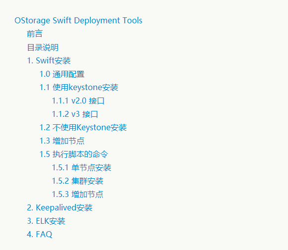

# OStorage Swift Deployment Tools
---
[TOC]

---

##前言
&nbsp;&nbsp;&nbsp;&nbsp;&nbsp;&nbsp;&nbsp;&nbsp;安装脚本主要实现Swift、Keepalived与ELK的安装功能，包括一些常用的命令脚本，如远程执行命令、拷贝文件以及部署ssh无密码访问等等，具体的使用说明，参见doc目录详细说明文档。
## 目录说明
    |---|/                  根目录
    |------|bin             脚本文件
    |------|conf.d          配置文件
    |------|data            运行产生的数据
    |------|doc             安装工具详细文档
    |------|error_log       脚本运行时日志文件
    |------|expect_script   expect脚本，实现人机交互
    |------|export_userinfo 导出用户环境变量模板
    |------|sample-conf     配置文件模板
    |------|tools           工具命令脚本
    |------|install.sh      单节点安装脚本
    |------|install_all.sh  集群安装脚本
    |------|README.md       说明文档
## 1. Swift安装
&nbsp;&nbsp;&nbsp;&nbsp;&nbsp;&nbsp;&nbsp;&nbsp;Swift的安装目前分为两种情况，单节点安装与集群安装，分别运行不同的脚本。安装之前需要修改配置文件，根据安装需求不一样，修改的配置也各不相同，如使用keystone的时候，需要修改conf.d/localrc.sh中对应的参数，在下面详细安装时会有具体介绍。
### 1.0 通用配置
&nbsp;&nbsp;&nbsp;&nbsp;&nbsp;&nbsp;&nbsp;&nbsp;在conf.d文件夹中，修改localrc.sh中的配置项。

```     
    1.安装过程是否停顿,true为停顿，false为不停顿
        export bugs_flag=false
    2.使用endpoint的接口类型,true为v2.0，false为v3
        enpoint_two=false
    3.当前脚本所在的文件夹的路径，据实际情况修改
        script_basename=SwiftDeployment
    4.指定生成ring文件的主机IP
        ring_server=192.168.80.181
    5.指定时间同步的主机IP
        time_server=192.168.80.181
    6.挂载硬盘名
        export devices=(
        sdb
        sdc
        )
    7.集群中的存储节点ip列表
        export storage_node_ips=(
        192.168.80.181
        192.168.80.182
        192.168.80.183
        )
    8.备用ip，当前版本与存储节点ip一致
        export storage_node_replica_ips=(
        192.168.80.181
        192.168.80.182
        192.168.80.183
        )
    9.指定生成ring文件节点账户与密码
        username=ubuntu
        keystone_controller_pass=123456
    10.指定所有存储节点账户名，顺序与存储节点ip对应
        export all_nodes_username=(
        ubuntu
        ubuntu
        ubuntu
        )
    11.指定所有存储节点密码，顺序与存储节点ip对应
        export all_nodes_password=(
        123456
        123456
        123456
        )
    12.指定每个节点的zone，顺序与存储节点ip对应
        storage_node_zones=(1 1 1)
    13.指定每个节点的region，顺序与存储节点ip对应
        storage_node_regions=(1 1 1)
    14.指定分区，副本数与最小rebalance时间（小时）
        maximum_partitions=10
        rinfs_replicas=2
        minimum_time=1
    15.指定hash前缀与后缀
        hash_path_suffix=demosuffix
        hash_path_prefix=demoprefix
```
### 1.1 使用keystone安装
&nbsp;&nbsp;&nbsp;&nbsp;&nbsp;&nbsp;&nbsp;&nbsp;使用Keystone安装时，首先需要确定使用哪一种接口，当前版本支持v2.0和v3的接口，在具体的配置项进行配置，在配置文件中，要开启keystone认证服务，然后确认是否需要注册swift账户与endpoint；**需要注意的是，安装前我们需要keystone的账户密码与endpoint才可操作，在export_userinfo目录下，有导出keystone用户认证信息的模板，根据使用的借口不同选择模板，具体情况配置，脚本才能正常使用**。
```
    1.使用keystone服务，true表示使用，false不使用
        keystone_use=true
    2.是否创建swift账户与endpoint，true为创建，false为不创建
        create_swift_or_not=true
    3.创建Siwft账户与endpoint需要的信息
        swift_username=swift
        swift_user_password=123
        swift_domain=default
        swift_region=RegionOne
        swift_endpoint_server=$ring_server
        注意：endpoint_server可设置为ip，为keystone所在ip
    
```

#### 1.1.1 v2.0 接口

```
    1.使用v2.0接口，true表示使用
        enpoint_two=true
    2.swift v2.0接口关于使用keystone的配置
        admin_password_proxy=123
            --|表示keystone中注册的swift账户密码
	    admin_user_proxy=swift
	        --|表示keystone中注册的swift账户名
	    admin_tenant_name_proxy=service
	        --|swift账户所属tenant，默认为service
	    memcached_servers_proxy=${primary_ip}:11211
	        --|memcache服务ip与端口，默认不修改
        identity_uri_proxy=http://${ring_server}:35357
	        --|${ring_server}替换为keystone的ip
        auth_uri_proxy=http://${ring_server}:5000/v2.0
            --|${ring_server}替换为keystone的ip
```
    
#### 1.1.2 v3 接口
```
    1.使用v3接口，false表示使用v3接口
        enpoint_two=false
    2.swift v3接口关于使用keystone的配置
        auth_uri_proxy=http://${ring_server}:5000
            --|${ring_server}替换为keystone的ip
        auth_url_proxy=http://${ring_server}:35357
            ${ring_server}替换为keystone的ip
        memcached_servers_proxy=${primary_ip}:11211
            ${ring_server}替换为keystone的ip
        project_domain_name_proxy=default
            --|与keystone中swift的账户所在domain一致
        user_domain_name_proxy=default
            --|与keystone中swift的账户所在proxy一致
        project_name_proxy=service
            --|swift所在的service，默认不用修改
        username_proxy=${swift_username}
            --|${swift_username}可替换为实际的swift账户名
	    password_proxy=${swift_user_password}
	        --|${swift_user_password}可替换为实际的swift账户密码
```
### 1.2 不使用Keystone安装
&nbsp;&nbsp;&nbsp;&nbsp;&nbsp;&nbsp;&nbsp;&nbsp;不使用keystone认证服务时，首先要将keystone认证服务选项设置为false.
```
    1.不使用keystone服务，true表示使用，false不使用
        keystone_use=false
```
### 1.3 增加节点
&nbsp;&nbsp;&nbsp;&nbsp;&nbsp;&nbsp;&nbsp;&nbsp;当我们集群已经部署完毕，需要增加节点时，仅需要在之前部署集群的配置上需盖下面的配置。需要注意的是，需要在之前生成ring文件的机器上执行脚本（这台机器一般作为控制节点）。
```
    假设我们现在集群中已经装好的两台机器，ip为：
        192.168.80.181
        192.168.80.182
    现在我们要增加一台机器，其ip为：
        192.168.80.183
    需要修改的选项有：
    1.集群中的存储节点ip列表
        export storage_node_ips=(
        192.168.80.181
        192.168.80.182
        192.168.80.183
        )
    2.备用ip，当前版本与存储节点ip一致
        export storage_node_replica_ips=(
        192.168.80.181
        192.168.80.182
        192.168.80.183
        )
    3.指定所有存储节点账户名，顺序与存储节点ip对应
        export all_nodes_username=(
        ubuntu
        ubuntu
        ubuntu
        )
    4.指定所有存储节点密码，顺序与存储节点ip对应
        export all_nodes_password=(
        123456
        123456
        123456
        )
    5.指定每个节点的zone，顺序与存储节点ip对应
        storage_node_zones=(1 1 1)
    6.指定每个节点的region，顺序与存储节点ip对应
        storage_node_regions=(1 1 1)
```

### 1.5 执行脚本的命令
#### 1.5.1 单节点安装
```
    当配置完成后，进入脚本根目录，执行如下命令：
        sudo -s . install.sh
```
#### 1.5.2 集群安装
```
    当配置完成后，进入脚本根目录，执行如下命令：
        sudo -s . install_all.sh
```
#### 1.5.3 增加节点
```
    当配置完成后，进入脚本/bin/目录，执行如下命令：
        sudo -s . add_node.sh
```

## 2. Keepalived安装
## 3. ELK安装
## 4. FAQ